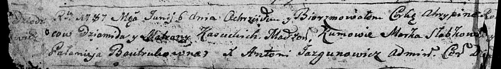

**Касуцкая Агрыпина (Kasucka Ahrypina)**

6 июня 1787 г --крещение (НИАБ 136-13-894, лист 1об, №19/1787-р (ориг)).

**НИАБ 136-13-894:** Лист 1об. **Метрическая запись №19/1787-р (ориг).**

{width="6.496527777777778in"
height="0.9038418635170604in"}

Дедиловичская Покровская церковь. 6 июня 1787 года. Метрическая запись о
крещении.

Kasucka Ahrypina - дочь родителей с деревни Дедиловичи.

Kasucki Dziomid -- отец.

Kasucka Matrona -- мать.

Słabkowski Marko - кум.

Bautrukowna Palanieja - кума.

Jazgunowicz Antoniusz -- ксёндз.
