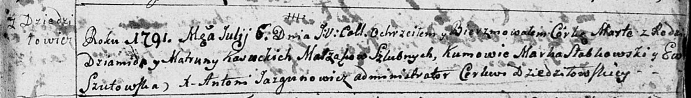
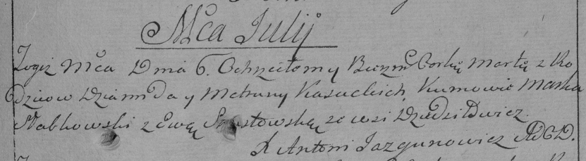
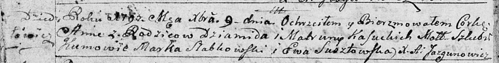

**Касуцкий Демид (Kasucki Dziomid, Dziamid)**

6 июня 1787 г --крещение дочери Агрыпины (НИАБ 136-13-894, лист 1об,
№19/1787-р (ориг)).

9 июля 1791 г --крещение дочери Марты (НИАБ 136-13-894, лист 13,
№27/1791-р (ориг)), (РГИА 823-2-18, лист 242, №14/1791-р (коп)).

9 декабря 1792 г --крещение дочери Анны (НИАБ 136-13-894, лист 17об,
№82/1792-р (ориг)).

**НИАБ 136-13-894:** Лист 1об. **Метрическая запись №19/1787-р (ориг).**

Дедиловичская Покровская церковь. 6 июня 1787 года. Метрическая запись о
крещении.

Kasucka Ahrypina - дочь родителей с деревни Дедиловичи.

Kasucki Dziomid -- отец.

Kasucka Matrona -- мать.

Słabkowski Marko - кум.

Bautrukowna Palanieja - кума.

Jazgunowicz Antoniusz -- ксёндз.

**НИАБ 136-13-894:** Лист 13. **Метрическая запись №27/1791-р (ориг).**

Дедиловичская Покровская церковь. 6 июля 1791 года. Метрическая запись о
крещении.

С Дедилович.

Kasucka Marta -- дочь родителей с деревни Дедиловичи.

Kasucki Dziamid -- отец.

Kasucka Matruna -- мать.

Słabkowski Marko -- кум.

Szutowska Ewa - кума.

Jazgunowicz Antoni -- ксёндз.

**РГИА 823-2-18:** Лист 242. **Метрическая запись №14/1791-р (коп).**

Дедиловичская Покровская церковь. 6 июля 1791 года. Метрическая запись о
крещении.

Kasucka Marta -- дочь родителей с деревни Дедиловичи.

Kasucki Dziamid -- отец.

Kasucka Matruna -- мать.

Słabkowski Marko -- кум.

Szustowska Ewa - кума.

Jazgunowicz Antoni -- ксёндз.

**НИАБ 136-13-894:** Лист 17-об. **Метрическая запись №82/1792-р
(ориг).**

Дедиловичская Покровская церковь. 9 декабря 1792 года. Метрическая
запись о крещении.

Kasucka Anna -- дочь родителей с деревни Дедиловичи.

Kasucki Dziamid -- отец.

Kasucka Matruna -- мать.

Słabkowski Markо - кум.

Susztowska Ewa - кума.

Jazgunowicz Antoni -- ксёндз.
