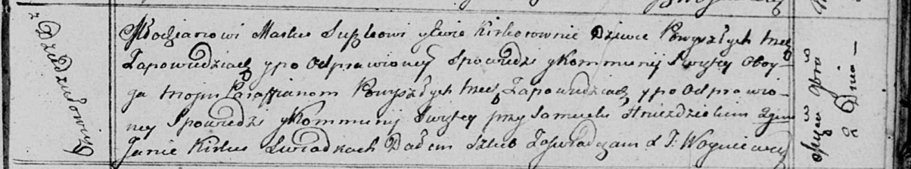

**Сушко (в девичестве Керко) Ева (Suszkowa Ewa z Kierkow)**

2 ноября 1813 г -- венчание с молодым Маркой Сушко с деревни Дедиловичи
(НИАБ 136-13-920, лист 20, №17/1813-б (ориг)).

**НИАБ 136-13-920:** Лист 20. **Метрическая запись №17/1813-б (ориг).**

{width="6.496527777777778in"
height="1.208921697287839in"}

Осовская Покровская церковь. 2 ноября 1813 года. Запись о венчании.

Suszko Markо -- жених, молодой, парафии Осовской, с деревни Дедиловичи.

Kirkowna Ewa -- невеста, девка, парафии Осовской, с деревни Дедиловичи.

Hniezdzicki Samuel -- свидетель.

Kirka Jan -- свидетель.

Woyniewicz Tomasz -- ксёндз.
