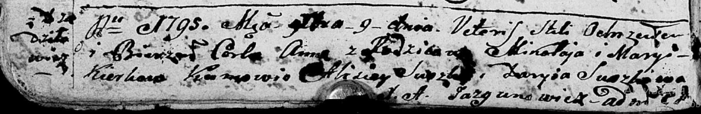
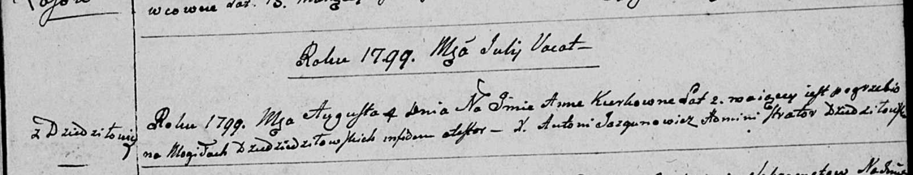
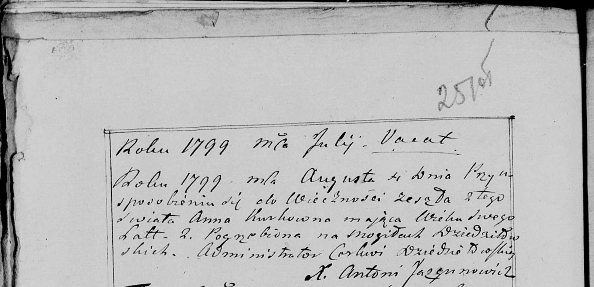

**Керко Анна Миколаева (Kierkowna Anna)**

9 декабря 1795 г -- крещение (НИАБ 136-13-894, лист 26об, №60/1795-р
(ориг)).

4 августа 1799 г -- отпевание, умерла в возрасте 2 года (НИАБ
136-13-919, лист 9, №12/1799-у (ориг), НИАБ 136-13-938, лист 251об,
№12/1799-у (коп)).

**НИАБ 136-13-894:** Лист 26об. **Метрическая запись №60/1795-р
(ориг).**

Дедиловичская Покровская церковь. 9 декабря 1795 года. Метрическая
запись о крещении.

Kierkowna Anna -- дочь родителей с деревни Дедиловичи.

Kierko Mikołay -- отец.

Kierkowa Maryia -- мать.

Suszko Alisiey - кум.

Suszkowa Daryia - кума.

Jazgunowicz Antoni -- ксёндз.

**НИАБ 136-13-919:** Лист 9. **Метрическая запись №12/1799-у (ориг).**

Дедиловичская Покровская церковь. 4 августа 1799 года. Метрическая
запись об отпевании.

Kierkowna Anna -- умершая, 2 года, с деревни Дедиловичи, похоронена на
кладбище деревни Дедиловичи.

Jazgunowicz Antoni -- ксёндз.

**НИАБ 136-13-938:** Лист 251об. **Метрическая запись №12/1799-у
(коп).**

(См. тж. НИАБ 136-13-919, Лист 9. Метрическая запись №12/1799-у (ориг))

Дедиловичская Покровская церковь. 4 августа 1799 года. Метрическая
запись об отпевании.

Kierkowna Anna -- умершая, 2 года, с деревни \[Дедиловичи\], похоронена
на кладбище деревни Дедиловичи.

Jazgunowicz Antoni -- ксёндз.
