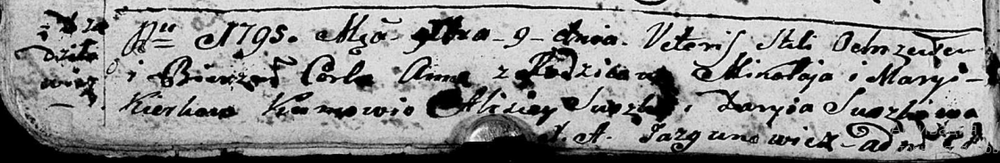

**Керко Марыя (Kierkowa, Kirkierowa Maryia)**

9 декабря 1795 г -- крещение дочери Анны (НИАБ 136-13-894, лист 26об,
№60/1795-р (ориг)).

10 февраля 1801 г -- крещение сына Сымона Элиаша (НИАБ 136-13-894, лист
43, №6/1801-р (ориг)).

26 марта 1818 г -- отпевание, умерла в возрасте 60 лет (родилась около
1758 г) (НИАБ 136-13-919, лист 31об, №6/1818-у (ориг)).

**НИАБ 136-13-894:** Лист 26об. **Метрическая запись №60/1795-р
(ориг).**

Дедиловичская Покровская церковь. 9 декабря 1795 года. Метрическая
запись о крещении.

Kierkowna Anna -- дочь родителей с деревни Дедиловичи.

Kierko Mikołay -- отец.

Kierkowa Maryia -- мать.

Suszko Alisiey - кум.

Suszkowa Daryia - кума.

Jazgunowicz Antoni -- ксёндз.

**НИАБ 136-13-894:** Лист 43. **Метрическая запись №6/1801-р (ориг).**

Дедиловичская Покровская церковь. 10 февраля 1801 года. Метрическая
запись о крещении.

Kierko Symon Elizeusz -- сын родителей \[с деревни Дедиловичи\].

Kierko Mikołay -- отец.

Kierkowa Marya -- мать.

Suszko Elizeusz -- кум.

Suszkowa Daryia -- кума.

Jazgunowicz Antoni -- ксёндз.

**НИАБ 136-13-919:** Лист 31об. **Метрическая запись №6/1818-у (ориг).**

Осовская униатская церковь. 26 марта 1818 года. Метрическая запись об
отпевании.

Kirkierowa Marija -- умершая, 60 лет, с деревни Дедиловичи, похоронена
на кладбище деревни Дедиловичи.

Woyniewicz Tomasz -- ксёндз.
