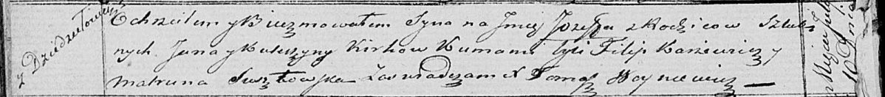

**Керко Ян (Kirko Jan)**

10 июля 1821 г -- крещение сына Иосифа (НИАБ 136-13-894, лист 106об,
№32/1821-р (ориг)).

**НИАБ 136-13-894:** Лист 106об. **Метрическая запись №32/1821-р
(ориг).**

Осовская Покровская церковь. 10 июля 1821 года. Метрическая запись о
крещении.

Kirko Jozef -- сын родителей с деревни Дедиловичи.

Kirko Jan -- отец.

Kirkowa Katerzyna -- мать.

Karżewicz Filip -- кум.

Susztowska Matruna -- кума.

Woyniewicz Tomasz -- ксёндз.
