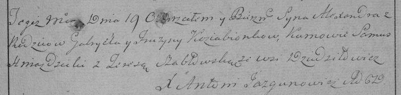

**Кобизёнок (Камизёнок) Гаврила (Kobizionek Hauryła, Kaziabionek,
Kabizionek, Kamisionek Gabriel)**

20 марта 1792 года -- крещение дочери Елены (НИАБ 136-13-894, лист 15об,
№17/1792-р (ориг)).

19 марта 1796 года -- крещение сына Александра (НИАБ 136-13-894, лист
28об, №33/1796-р (ориг)), (РГИА 823-2-18, лист 255, №13/1796-р (коп)).

25 апреля 1798 года -- крещение дочери Марьяны (НИАБ 136-13-894, лист
36, №19/1798-р (ориг)), (РГИА 823-2-18, лист 263, №19/1798-р (коп)).

13 марта 1799 г -- крестный отец Агафии Параскевии, дочери Варавичей
Андрея и Евгении с деревни Пядань (НИАБ 136-13-938, лист 241, №15/1799-р
(коп)).

**НИАБ 136-13-894:** Лист 15об. **Метрическая запись №17/1792-р
(ориг).**

{width="6.496527777777778in"
height="0.6228991688538933in"}

Дедиловичская Покровская церковь. 20 марта 1792 года. Метрическая запись
о крещении.

Kobizionkowna Elena -- дочь родителей с деревни Дедиловичи.

Kobizionek Hauryła -- отец.

Kobizionkowa Pruzyna -- мать.

Huzniak Leon - кум.

Busłowna Krystyna - кума.

Jazgunowicz Antoni -- ксёндз.

**НИАБ 136-13-894:** Лист 28об. **Метрическая запись №33/1796-р
(ориг).**

{width="6.496527777777778in"
height="0.8106408573928259in"}

Дедиловичская Покровская церковь. 19 марта 1796 года. Метрическая запись
о крещении.

Kaziabionak Alexander -- сын родителей с деревни Дедиловичи.

Kaziabionek Gabriel -- отец.

Kaziabionkowa Pruzyna -- мать.

Hniazdzicki Samuś - кум.

Słabkowska Teresa - кума.

Jazgunowicz Antoni -- ксёндз.

**РГИА 823-2-18:** Лист 255. **Метрическая запись №13/1796-р (коп).**

{width="6.496527777777778in"
height="1.5416666666666667in"}

Дедиловичская Покровская церковь. 19 марта 1796 года. Метрическая запись
о крещении.

Koziabionek Alexander -- сын родителей с деревни Дедиловичи.

Koziabionek Gabryel -- отец.

Koziabionkowa Fruzyna -- мать.

Hnazdzicki Samuś -- кум.

Szabłowska Teresa -- кума.

Jazgunowicz Antoni -- ксёндз.

**НИАБ 136-13-894:** Лист 36. **Метрическая запись №19/1798-р (ориг).**

{width="6.496527777777778in"
height="0.7187817147856518in"}

Дедиловичская Покровская церковь. 25 апреля 1798 года. Метрическая
запись о крещении.

Kabizionkowna Marjana -- дочь родителей с деревни Дедиловичи.

Kabizionek Gabriel -- отец.

Kabizionkowa Pruzyna -- мать.

Hniazdzicki Samuel - кум.

Słabkowska Teresa - кума.

Jazgunowicz Antoni -- ксёндз.

**РГИА 823-2-18:** Лист 263. **Метрическая запись №19/1798-р (коп).**

{width="6.496527777777778in"
height="1.6791666666666667in"}

Дедиловичская Покровская церковь. 25 апреля 1798 года. Метрическая
запись о крещении.

Kabizionkowna Marjanna -- дочь родителей с деревни Дедиловичи.

Kabizionek Gabriel -- отец.

Kabizionkowa Pruzyna -- мать.

Hniazdowski Samuel -- кум.

Słabkowska Theresia -- кума.

Jazgunowicz Antoni -- ксёндз.

**НИАБ 136-13-938:** Лист 241. **Метрическая запись №15/1799-р (коп).**

(См. тж. НИАБ 136-13-894, лист 38об, №15/1799-р (ориг); РГИА 823-2-18,
лист 268об, №15/1799-р (коп))

{width="6.496527777777778in"
height="2.19375in"}

Дедиловичская Покровская церковь. 13 марта 1799 года. Метрическая запись
о крещении.

Warawiczowna Ahafia Efrozynia -- дочь родителей с деревни \[Пядань\].

Warawicz Andrzey -- отец.

Warawiczowa Euhenija -- мать.

Kamisionek Gabruś -- кум, с деревни Дедиловичи.

Suszkowa Darya - кума, с деревни Дедиловичи.

Jazgunowicz Antoni -- ксёндз.
