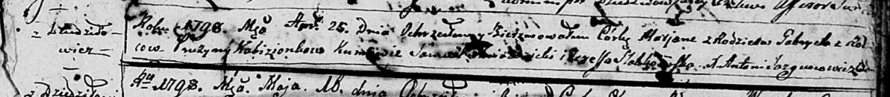

**Кобизёнок Марьяна Гаврилова (Kabizionkowa Marjana)**

25 апреля 1798 года -- крещение (НИАБ 136-13-894, лист 36, №19/1798-р
(ориг)), (РГИА 823-2-18, лист 263, №19/1798-р (коп)).

**НИАБ 136-13-894:** Лист 36. **Метрическая запись №19/1798-р (ориг).**

Дедиловичская Покровская церковь. 25 апреля 1798 года. Метрическая
запись о крещении.

Kabizionkowna Marjana -- дочь родителей с деревни Дедиловичи.

Kabizionek Gabriel -- отец.

Kabizionkowa Pruzyna -- мать.

Hniazdzicki Samuel - кум.

Słabkowska Teresa - кума.

Jazgunowicz Antoni -- ксёндз.

**РГИА 823-2-18:** Лист 263. **Метрическая запись №19/1798-р (коп).**

Дедиловичская Покровская церковь. 25 апреля 1798 года. Метрическая
запись о крещении.

Kabizionkowna Marjanna -- дочь родителей с деревни Дедиловичи.

Kabizionek Gabriel -- отец.

Kabizionkowa Pruzyna -- мать.

Hniazdowski Samuel -- кум.

Słabkowska Theresia -- кума.

Jazgunowicz Antoni -- ксёндз.
