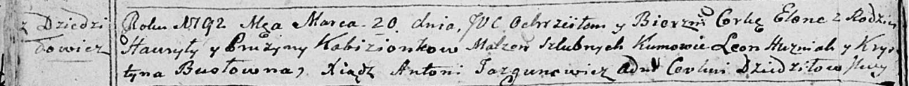
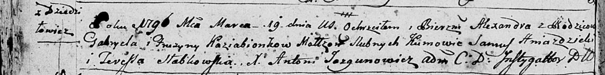
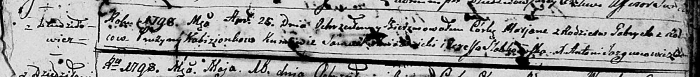
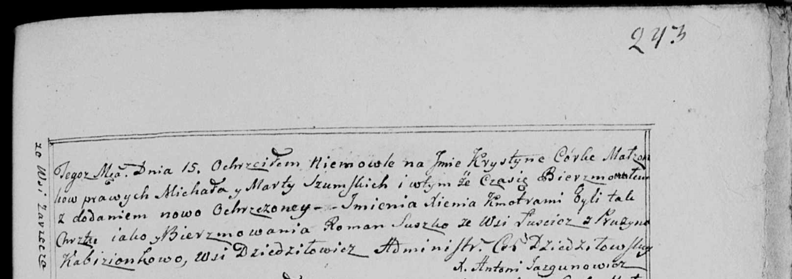

**Кобизёнок Прузына (Kobizionkowa, Kabizionkowa, Kazabionkowa Pruzyna)**

20 марта 1792 года -- крещение дочери Елены (НИАБ 136-13-894, лист 15об,
№17/1792-р (ориг)).

19 марта 1796 года -- крещение сына Александра (НИАБ 136-13-894, лист
28об, №33/1796-р (ориг)), (РГИА 823-2-18, лист 255, №13/1796-р (коп)).

25 апреля 1798 года -- крещение дочери Марьяны (НИАБ 136-13-894, лист
36, №19/1798-р (ориг)), (РГИА 823-2-18, лист 263, №19/1798-р (коп)).

16 июля 1799 г -- крестная мать Крыстыны Ксени, дочери Шумских Михала и
Марты с деревни Заречье (НИАБ 136-13-938, лист 243, №29/1799-р (коп)).

23 сентября 1800 г -- крестная мать Винцента Иосифа, сына Шпетов Сымона
и Прузызы с деревни Дедиловичи (НИАБ 136-13-949, лист 103об, №29/1800-р
(коп)).

**НИАБ 136-13-894:** Лист 15об. **Метрическая запись №17/1792-р
(ориг).**

Дедиловичская Покровская церковь. 20 марта 1792 года. Метрическая запись
о крещении.

Kobizionkowna Elena -- дочь родителей с деревни Дедиловичи.

Kobizionek Hauryła -- отец.

Kobizionkowa Pruzyna -- мать.

Huzniak Leon - кум.

Busłowna Krystyna - кума.

Jazgunowicz Antoni -- ксёндз.

**НИАБ 136-13-894:** Лист 28об. **Метрическая запись №33/1796-р
(ориг).**

Дедиловичская Покровская церковь. 19 марта 1796 года. Метрическая запись
о крещении.

Kaziabionak Alexander -- сын родителей с деревни Дедиловичи.

Kaziabionek Gabriel -- отец.

Kaziabionkowa Pruzyna -- мать.

Hniazdzicki Samuś - кум.

Słabkowska Teresa - кума.

Jazgunowicz Antoni -- ксёндз.

**РГИА 823-2-18:** Лист 255. **Метрическая запись №13/1796-р (коп).**

Дедиловичская Покровская церковь. 19 марта 1796 года. Метрическая запись
о крещении.

Koziabionek Alexander -- сын родителей с деревни Дедиловичи.

Koziabionek Gabryel -- отец.

Koziabionkowa Fruzyna -- мать.

Hnazdzicki Samuś -- кум.

Szabłowska Teresa -- кума.

Jazgunowicz Antoni -- ксёндз.

**НИАБ 136-13-894:** Лист 36. **Метрическая запись №19/1798-р (ориг).**

Дедиловичская Покровская церковь. 25 апреля 1798 года. Метрическая
запись о крещении.

Kabizionkowna Marjana -- дочь родителей с деревни Дедиловичи.

Kabizionek Gabriel -- отец.

Kabizionkowa Pruzyna -- мать.

Hniazdzicki Samuel - кум.

Słabkowska Teresa - кума.

Jazgunowicz Antoni -- ксёндз.

**РГИА 823-2-18:** Лист 263. **Метрическая запись №19/1798-р (коп).**

Дедиловичская Покровская церковь. 25 апреля 1798 года. Метрическая
запись о крещении.

Kabizionkowna Marjanna -- дочь родителей с деревни Дедиловичи.

Kabizionek Gabriel -- отец.

Kabizionkowa Pruzyna -- мать.

Hniazdowski Samuel -- кум.

Słabkowska Theresia -- кума.

Jazgunowicz Antoni -- ксёндз.

**НИАБ 136-13-938:** Лист 243. **Метрическая запись №29/1799-р (коп).**

(См. тж. НИАБ 136-13-894, лист 39, №31/1799-р (ориг); РГИА 823-2-18,
лист 271, №30/1799-р (коп))

Дедиловичская Покровская церковь. 15 августа 1799 года. Метрическая
запись о крещении.

Szumska Krystyna Xienia -- дочь родителей с деревни Заречье.

Szumski Michał -- отец.

Szumska Marta -- мать.

Suszko Roman -- кум, c деревни Лустичи.

Kabizionkowa Pruzyna - кума, с деревни Дедиловичи.

Jazgunowicz Antoni -- ксёндз.

**НИАБ 136-13-949:** Лист 103об. **Метрическая запись №29/1800-р
(коп).**

(См. тж.: НИАБ 136-13-894, лист 42, №26/1800-р (ориг))

Дедиловичская Покровская церковь. 23 сентября 1800 года. Метрическая
запись о крещении.

Szpet Wincenty Jozef -- сын родителей с деревни Дедиловичи.

Szpet Symon -- отец.

Szpetowa Pruzyna -- мать.

Czaplay Awram -- кум, с деревни Дедиловичи.

Kabizionkowa Fruzyna - кума, с деревни Дедиловичи.

Jazgunowicz Antoni -- ксёндз.
