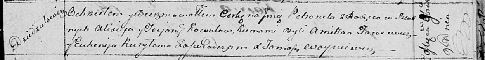

**Коваль Аликсей (Kowal Alixiey)**

9 ноября 1814 г -- крещение дочери Петронели (НИАБ 136-13-894, лист 91,
№63/1814-р (ориг)).

**НИАБ 136-13-894:** Лист 91. **Метрическая запись №63/1814-р (ориг).**

Осовская Покровская церковь. 9 ноября 1814 года. Метрическая запись о
крещении.

Kowalowna Petronela -- дочь родителей с деревни Дедиловичи.

Kowal Alixiey -- отец.

Kowalowa Teciana -- мать.

Tarasewicz Amillan -- кум.

Kuryłowa Euhenija -- кума.

Woyniewicz Tomasz -- ксёндз.
