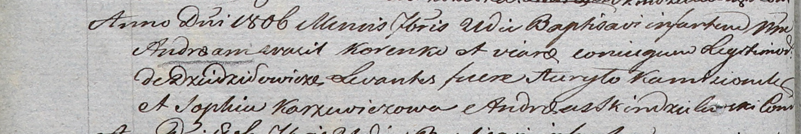

**Коренько Андрей Василев (Korenko Andreas)**

21 сентября 1806 г -- крещение (НИАБ 937-4-32, лист 13об, №18/1806-р).

**НИАБ 937-4-32:** Лист 13об. **Метрическая запись №18/1806-р.**

{width="6.496527777777778in"
height="1.0958333333333334in"}

Дедиловичский костел Наисвятейшего Сердца Иисуса. 21 сентября 1806 года.
Метрическая запись о крещении.

Korenko Andreas -- сын родителей с деревни Дедиловичи.

Korenko Wasil -- отец.

Korenkowa Viara -- мать.

Kamosionek Haryło -- крестный отец.

Karzewiczowa Sophia -- крестная мать.

Skindzelewski Andreas -- ксёндз, комендант Дедиловичский.
