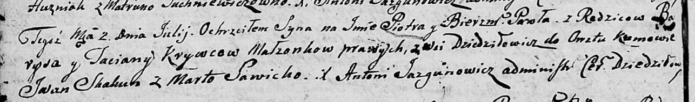

**Кривец Татьяна (Krywcowa Taciana)**

6 апреля 1802 г -- крестная мать Луки, сына Дениса и Натальи Гузняков с
деревни Отруб (НИАБ 937-4-32, лист 6, №8/1802-р).

2 июля 1805 г -- крещение сына Петра Павла (НИАБ 136-13-894, лист 57об,
№30/1805-р (ориг)).

**НИАБ 937-4-32:** Лист 6. **Метрическая запись №8/1802-р.**

{width="6.496527777777778in"
height="0.8388888888888889in"}

Дедиловичский костел Наисвятейшего Сердца Иисуса. 6 апреля 1802 года.
Метрическая запись о крещении.

Huzniak Łuca -- сын крестьян с деревни Отруб.

Huzniak Dzienis -- отец.

Huzniakowa Natalia -- мать.

Suszko Samuel -- крестный отец.

Krywcowa Tacyana -- крестная мать, с деревни Дедиловичи.

Linhart Hyacinthus -- ксёндз.

**НИАБ 136-13-894:** Лист 57об. **Метрическая запись №30/1805-р
(ориг).**

{width="6.496527777777778in"
height="0.9601640419947507in"}

Дедиловичская Покровская церковь. 2 июля 1805 года. Метрическая запись о
крещении.

Krywec Piotr Paweł -- сын родителей с деревни Дедиловичи.

Krywec Barys -- отец.

Krywcowa Taciana -- мать.

Skakun Jwan -- кум.

Sawicka Marta -- кума.

Jazgunowicz Antoni -- ксёндз.
