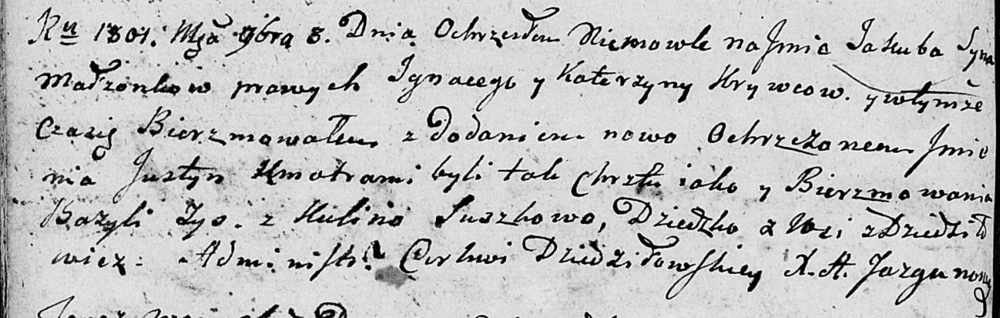
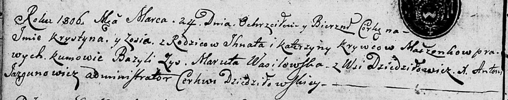

**Кривец Катерына (Krywcowa Katerzyna, Catharina)**

27 мая 1800 г -- крещение сына Петра (НИАБ 837-4-32, лист 2,
№16/1800-р).

3 ноября 1801 г -- крещение сына Якуба Юстына (НИАБ 136-13-894, лист
44об, №26/1801-р (ориг)).

24 марта 1806 г -- крещение дочери Крыстыны Зоси (НИАБ 136-13-894, лист
59об, №13/1806-р (ориг)).

**НИАБ 937-4-32:** Лист 2. **Метрическая запись №16/1800-р.**

Дедиловичский костел Наисвятейшего Сердца Иисуса. 27 мая 1800 года.
Метрическая запись о крещении.

Krywiec Petrus -- сын крестьян с деревни Дедиловичи.

Krywiec Jgnati -- отец.

Krywcowa Catharina -- мать.

Zys Basili -- крестный отец.

Suszkowa daria -- крестная мать, с деревни Дедиловичи.

Linhart Hyacinthus -- ксёндз.

**НИАБ 136-13-894:** Лист 44об. **Метрическая запись №26/1801-р
(ориг).**

Дедиловичская Покровская церковь. 3 ноября 1801 года. Метрическая запись
о крещении.

Kryweć Jakub Justyn -- сын родителей с деревни Дедиловичи.

Kryweć Jgnacy -- отец.

Krywcowa Katerzyna -- мать.

Zys Bazyli -- кум.

Suszkowa Kulina -- кума.

Jazgunowicz Antoni -- ксёндз.

**НИАБ 136-13-894: Метрическая запись №13/1806-р (ориг).**

Дедиловичская Покровская церковь. 24 марта 1806 года. Метрическая запись
о крещении.

Krywcowna Krystyna Zosia -- дочь родителей с деревни Дедиловичи.

Kryweć Jhnat -- отец.

Krywcowa Katerzyna -- мать.

Zys Bazyli -- кум.

Wasilewska Maruta -- кума.

Jazgunowicz Antoni -- ксёндз.
