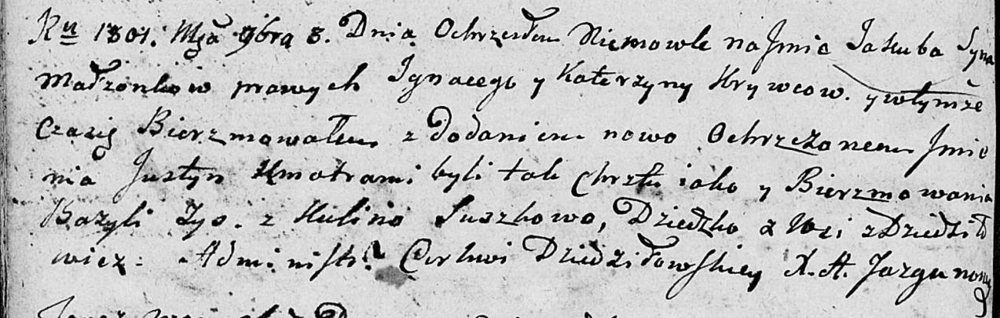

**Кривец Якуб Игнатьев (Krywiec Jakub Justyn)**

3 ноября 1801 г -- крещение (НИАБ 136-13-894, лист 44об, №26/1801-р
(ориг)).

**НИАБ 136-13-894:** Лист 44об. **Метрическая запись №26/1801-р
(ориг).**

{width="6.496527777777778in"
height="2.067168635170604in"}

Дедиловичская Покровская церковь. 3 ноября 1801 года. Метрическая запись
о крещении.

Kryweć Jakub Justyn -- сын родителей с деревни Дедиловичи.

Kryweć Jgnacy -- отец.

Krywcowa Katerzyna -- мать.

Zys Bazyli -- кум.

Suszkowa Kulina -- кума.

Jazgunowicz Antoni -- ксёндз.
