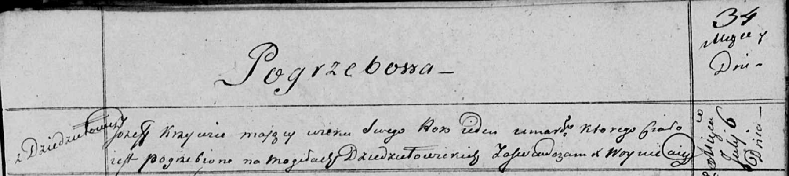

**Кривец Иосиф (Krywiec Jozef)**

6 июля 1820 г -- отпевание, умер в возрасте 1 год (родился около 1819 г)
(НИАБ 136-13-919, лист 34, №15/1820-у (ориг)).

**НИАБ 136-13-894:** Лист 34. **Метрическая запись №15/1820-у (ориг).**

Осовская униатская церковь. 6 июля 1820 года. Метрическая запись об
отпевании.

Krywiec Jozef -- умерший, 1 год, с деревни Дедиловичи, похоронен на
кладбище деревни Дедиловичи.

Woyniewicz Tomasz -- ксёндз.
