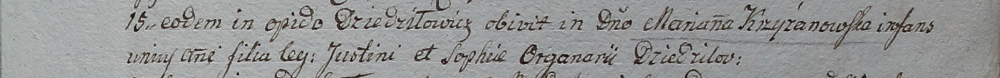

**Крыжановская Марьяна Юстинова, шляхтянка (Kryżanowska Mariana)**

15 января 1799 г -- отпевание, умерла в возрасте 1 года (родилась около
1798 г) (НИАБ 1781-27-199, лист 127, №4/1799-р).

**НИАБ 1781-27-199:** Лист 127. **Метрическая запись №4/1799-у.**

{width="6.496527777777778in"
height="0.5131944444444444in"}

Дедиловичский костел Наисвятейшего Сердца Иисуса. 15 января 1799 года.
Метрическая запись об отпевании.

Kryżanowska Mariana -- умершая, 1 год, дочь шляхтичей Justini et Sophiae
с деревни Дедиловичи.

Linhart Hyacinthus -- ксёндз.
