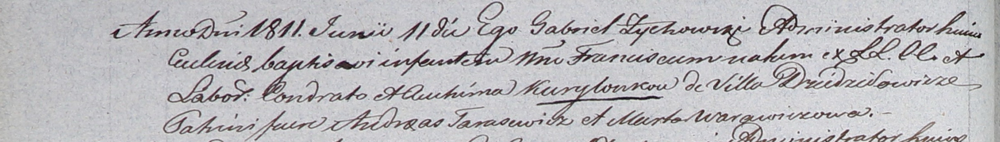

**Курилович Авхима (Kuryłowcowa Auchima)**

11 июня 1811 г -- крещение сына Франциска (НИАБ 937-4-32, лист 23об,
№10/1811-р).

**НИАБ 937-4-33:** Лист 23об. **Метрическая запись №10/1811-р.**

{width="6.496527777777778in"
height="0.9236111111111112in"}

Дедиловичский костел Наисвятейшего Сердца Иисуса. 11 июня 1811 года.
Метрическая запись о крещении.

Kuryłowiec Francisc -- сын крестьян с деревни Дедиловичи.

Kuryłowiec Condrat -- отец.

Kuryłowcowa Auhima -- мать.

Tarasewicz Andreas -- крестный отец.

Warawiczowa Marta -- крестная мать.

Zychowski Gabriel -- ксёндз.
