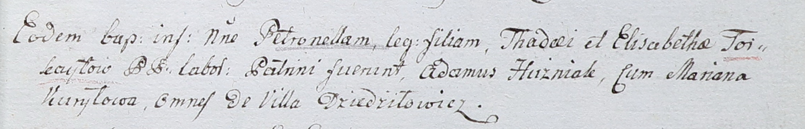

**Курилович Марьяна (Kuryłowa Mariana)**

30 ноября 1785 г -- крещение сына Наума (РГИА 823-2-18, лист 230об,
№30/1785-р (коп)).

23 января 1788 г --крещение дочери Дороты (НИАБ 136-13-894, лист 3об,
№9/1788-р (ориг)).

26 февраля 1799 г -- крещение сына Петра Павла (НИАБ 136-13-894, лист
38об, №14/1799-р (ориг)), (РГИА 823-2-18, лист 268об, №13/1799-р (коп),
НИАБ 136-13-938, лист 241, №14/1799-р (коп)).

3 августа 1802 г -- крестная мать Каетана, сына Петра и Евы Бортновских
с деревни Дедиловичи (НИАБ 937-4-32, лист 7, №21/1802-р).

24 августа 1802 г -- крестная мать Петронели, дочери Тадея и Елизабеты
Торкайлов с деревни Дедиловичи (НИАБ 937-4-32, лист 7, №25/1802-р).

**НИАБ 937-4-33:** Лист 7. **Метрическая запись №21/1802-р.**

{width="6.496527777777778in"
height="0.9875in"}

Дедиловичский костел Наисвятейшего Сердца Иисуса. 3 августа 1802 года.
Метрическая запись о крещении.

Bartnowski Caetan -- сын вольных людей с деревни Дедиловичи.

Bartnowski Petrus -- отец.

Bartnowska Eva -- мать.

Popko Atrachim -- крестный отец, крестьянин, с деревни Дедиловичи.

Kuryłowa Mariana -- крестная мать, крестьянка, с деревни Дедиловичи.

Linhart Hyacinthus -- ксёндз.

**НИАБ 937-4-32:** Лист 7. **Метрическая запись №25/1802-р.**

{width="6.496527777777778in"
height="1.0472222222222223in"}

Дедиловичский костел Наисвятейшего Сердца Иисуса. 24 августа 1802 года.
Метрическая запись о крещении.

Torkayłowna Petronella -- дочь крестьян с деревни Дедиловичи.

Torkayło Thadey -- отец.

Torkayłowa Elisabetha -- мать.

Huzniak Adam -- крестный отец, с деревни Дедиловичи.

Kuryłowa Mariana -- крестная мать, с деревни Дедиловичи.

Linhart Hyacinthus -- ксёндз.
