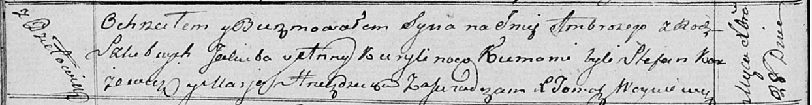

**Курилович Амброзы Якубов (Kurylin Ambrozy)**

28 декабря 1817 г -- крещение (НИАБ 136-13-894, лист 97об, №66/1817-р
(ориг)).

**НИАБ 136-13-894:** Лист 97об. **Метрическая запись №66/1817-р
(ориг).**

{width="6.496527777777778in"
height="0.8461778215223097in"}

Осовская Покровская церковь. 28 декабря 1817 года. Метрическая запись о
крещении.

Kuryłin Ambrozy -- сын родителей с деревни Дедиловичи.

Kurylin Jakub -- отец.

Kurylinowa Anna -- мать.

Karżewicz Stefan -- кум.

Hrniezdzicka Marja -- кума.

Woyniewicz Tomasz -- ксёндз.
