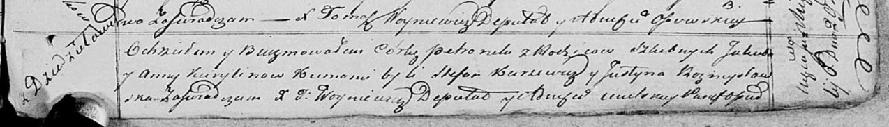

**Курилович Якуб (Kurylin Jakub)**

28 декабря 1817 г -- крещение сына Амброзыя (НИАБ 136-13-894, лист 97об,
№66/1817-р (ориг)).

6 июля 1820 г -- крещение дочери Петронели (НИАБ 136-13-894, лист 104,
№20/1820-р (ориг)).

**НИАБ 136-13-894:** Лист 97об. **Метрическая запись №66/1817-р
(ориг).**

{width="6.496527777777778in"
height="0.8461778215223097in"}

Осовская Покровская церковь. 28 декабря 1817 года. Метрическая запись о
крещении.

Kuryłin Ambrozy -- сын родителей с деревни Дедиловичи.

Kurylin Jakub -- отец.

Kurylinowa Anna -- мать.

Karżewicz Stefan -- кум.

Hrniezdzicka Marja -- кума.

Woyniewicz Tomasz -- ксёндз.

**НИАБ 136-13-894:** Лист 104. **Метрическая запись №20/1820-р (ориг).**

{width="6.496527777777778in"
height="0.9333431758530184in"}

Осовская Покровская церковь. 6 июля 1820 года. Метрическая запись о
крещении.

Kurylinowna Petronela -- дочь родителей с деревни Дедиловичи.

Kurylin Jakub -- отец.

Kurylinowa Anna -- мать.

Karżewicz Stefan -- кум.

Rozmysłowska Justyna -- кума.

Woyniewicz Tomasz -- ксёндз.
