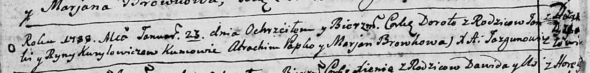

**Курилович Дорота Янова (Kuryłowiczowna Dorota)**

23 января 1788 г --крещение (НИАБ 136-13-894, лист 3об, №9/1788-р
(ориг)).

**НИАБ 136-13-894:** Лист 3об. **Метрическая запись №9/1788-р (ориг).**

{width="6.496527777777778in"
height="0.811981627296588in"}

Дедиловичская Покровская церковь. 23 января 1788 года. Метрическая
запись о крещении.

Kuryłowiczowa Dorota -- дочь родителей с деревни Дедиловичи.

Kuryłowicz Janka -- отец.

Kuryłowiczowa Ryna -- мать.

Papko Atrachim - кум.

Browkowa Marjana - кума.

Jazgunowicz Antoniusz -- ксёндз.
