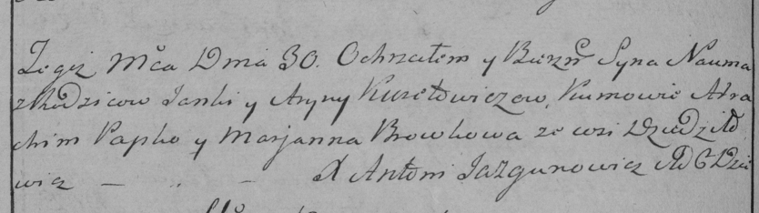

**Курилович Наум Янов (Kurełowicz Naum)**

30 ноября 1785 г -- крещение (РГИА 823-2-18, лист 230об, №30/1785-р
(коп)).

**РГИА 823-2-18:** Лист 230об. **Метрическая запись №30/1785-р (коп).**

Дедиловичская Покровская церковь. 30 ноября 1785 года. Метрическая
запись о крещении.

Kurełowicz Naum -- сын родителей с деревни Дедиловичи.

Kurełowicz Janka -- отец.

Kurełowiczowa Aryna -- мать.

Papko Atrachim -- кум.

Browkowa Marjana - кума.

Jazgunowicz Antoni -- ксёндз.
