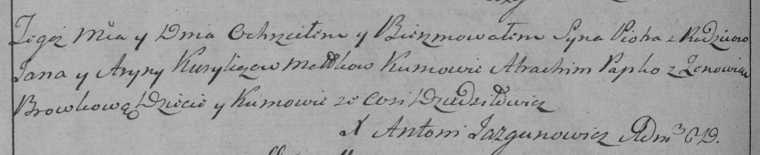
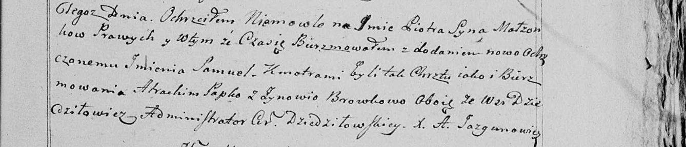

**Курилович Пётр Янов (Kurylicz Piotr Samuel)**

26 февраля 1799 г -- крещение (НИАБ 136-13-894, лист 38об, №14/1799-р
(ориг)), (РГИА 823-2-18, лист 268об, №13/1799-р (коп), НИАБ 136-13-938,
лист 241, №14/1799-р (коп)).

**НИАБ 136-13-894:** Лист 38об. **Метрическая запись №14/1799-р
(ориг).**

Дедиловичская Покровская церковь. 26 февраля 1799 года. Метрическая
запись о крещении.

Kurylicz Piotr Samuel -- сын родителей с деревни Дедиловичи.

Kurylicz Jan -- отец.

Kuryliczowa Aryna -- мать.

Papko Atrachim-- кум.

Browkowa Zynowia -- кума.

Jazgunowicz Antoni -- ксёндз.

**РГИА 823-2-18:** Лист 268об. **Метрическая запись №14/1799-р (коп).**

Дедиловичская Покровская церковь. 26 февраля 1799 года. Метрическая
запись о крещении.

Kurylicz Piotr -- сын родителей с деревни Дедиловичи.

Kurylicz Jan -- отец.

Kuryliczowa Aryna -- мать.

Papko Atrachim -- кум, с деревни Дедиловичи.

Browkowa Zenowia -- кума, с деревни Дедиловичи.

Jazgunowicz Antoni -- ксёндз.

**НИАБ 136-13-938:** Лист 241. **Метрическая запись №14/1799-р (коп).**

(См. тж. НИАБ 136-13-894, лист 38об, №14/1799-р (ориг); РГИА 823-2-18,
лист 268об, №14/1799-р (коп))

Дедиловичская Покровская церковь. 26 февраля 1799 года. Метрическая
запись о крещении.

\[Kurylicz\] Piotr Samuel -- сын родителей с деревни \[Дедиловичи\].

\[Kurylicz Jan\] -- отец.

\[Kurylicz Aryna\] -- мать.

Papko Atrachim -- кум, с деревни Дедиловичи.

Browkowa Zynowia - кума, с деревни Дедиловичи.

Jazgunowicz Antoni -- ксёндз.
