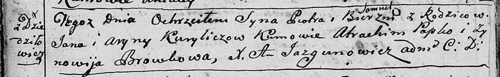

**Курилович Ян (Kurełowicz, Kuryłowicz, Kurylicz Janka, Jan)**

30 ноября 1785 г -- крещение сына Наума (РГИА 823-2-18, лист 230об,
№30/1785-р (коп)).

23 января 1788 г -- крещение дочери Дороты (НИАБ 136-13-894, лист 3об,
№9/1788-р (ориг)).

26 февраля 1799 г -- крещение сына Петра Павла (НИАБ 136-13-894, лист
38об, №14/1799-р (ориг)), (РГИА 823-2-18, лист 268об, №13/1799-р (коп),
НИАБ 136-13-938, лист 241, №14/1799-р (коп)).

**РГИА 823-2-18:** Лист 230об. **Метрическая запись №30/1785-р (коп).**

{width="6.496527777777778in"
height="1.8229166666666667in"}

Дедиловичская Покровская церковь. 30 ноября 1785 года. Метрическая
запись о крещении.

Kurełowicz Naum -- сын родителей с деревни Дедиловичи.

Kurełowicz Janka -- отец.

Kurełowiczowa Aryna -- мать.

Papko Atrachim -- кум.

Browkowa Marjana - кума.

Jazgunowicz Antoni -- ксёндз.

**НИАБ 136-13-894:** Лист 3об. **Метрическая запись №9/1788-р (ориг).**

{width="6.496527777777778in"
height="0.811981627296588in"}

Дедиловичская Покровская церковь. 23 января 1788 года. Метрическая
запись о крещении.

Kuryłowiczowa Dorota -- дочь родителей с деревни Дедиловичи.

Kuryłowicz Janka -- отец.

Kuryłowiczowa Ryna -- мать.

Papko Atrachim - кум.

Browkowa Marjana - кума.

Jazgunowicz Antoniusz -- ксёндз.

**НИАБ 136-13-894:** Лист 38об. **Метрическая запись №14/1799-р
(ориг).**

{width="6.496527777777778in"
height="1.0117924321959755in"}

Дедиловичская Покровская церковь. 26 февраля 1799 года. Метрическая
запись о крещении.

Kurylicz Piotr Samuel -- сын родителей с деревни Дедиловичи.

Kurylicz Jan -- отец.

Kuryliczowa Aryna -- мать.

Papko Atrachim-- кум.

Browkowa Zynowia -- кума.

Jazgunowicz Antoni -- ксёндз.

**РГИА 823-2-18:** Лист 268об. **Метрическая запись №14/1799-р (коп).**

{width="6.496527777777778in"
height="1.3256944444444445in"}

Дедиловичская Покровская церковь. 26 февраля 1799 года. Метрическая
запись о крещении.

Kurylicz Piotr -- сын родителей с деревни Дедиловичи.

Kurylicz Jan -- отец.

Kuryliczowa Aryna -- мать.

Papko Atrachim -- кум, с деревни Дедиловичи.

Browkowa Zenowia -- кума, с деревни Дедиловичи.

Jazgunowicz Antoni -- ксёндз.

**НИАБ 136-13-938:** Лист 241. **Метрическая запись №14/1799-р (коп).**

(См. тж. НИАБ 136-13-894, лист 38об, №14/1799-р (ориг); РГИА 823-2-18,
лист 268об, №14/1799-р (коп))

{width="6.496527777777778in"
height="1.4034722222222222in"}

Дедиловичская Покровская церковь. 26 февраля 1799 года. Метрическая
запись о крещении.

\[Kurylicz\] Piotr Samuel -- сын родителей с деревни \[Дедиловичи\].

\[Kurylicz Jan\] -- отец.

\[Kurylicz Aryna\] -- мать.

Papko Atrachim -- кум, с деревни Дедиловичи.

Browkowa Zynowia - кума, с деревни Дедиловичи.

Jazgunowicz Antoni -- ксёндз.
