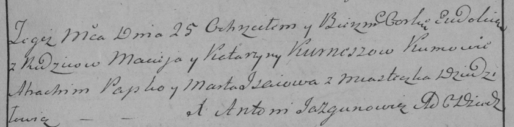

**Курнеш Евдокия Мацеева (Kurneszowna Eudokia)**

25 февраля 1786 года -- крещение (РГИА 823-2-18, лист 231, №7/1786-р
(коп)).

**РГИА 836-2-18:** Лист 231. **Метрическая запись №7/1786-р (коп).**

{width="6.496527777777778in"
height="1.6125in"}

Дедиловичская Покровская церковь. 25 февраля 1786 года. Метрическая
запись о крещении.

Kurneszowna Eudokia -- дочь родителей с местечка Дедиловичи.

Kurnesz Maciey -- отец.

Kurneszowa Katarzyna -- мать.

Papko Atrachim -- кум.

Jsaiowa Marta - кума.

Jazgunowicz Antoni -- ксёндз.
