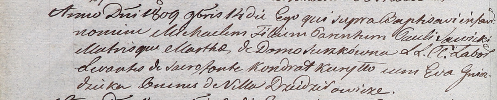

**Курыло Кондрат (Kuryłło Kondrat)**

14 ноября 1809 г -- крестный отец Михала, сына Павла и Марты Савицких с
деревни Дедиловичи (НИАБ 937-4-32, лист 20об, №31/1809-р).

**НИАБ 937-4-32:** Лист 20об. **Метрическая запись №31/1809-р.**

Дедиловичский костел Наисвятейшего Сердца Иисуса. 14 ноября 1809 года.
Метрическая запись о крещении.

Sawicki Michael -- сын крестьян с деревни Дедиловичи.

Sawicki Paul -- отец.

Sawicka Martha z Surzkow -- мать.

Kuryłło Kondrat -- крестный отец, с деревни Дедиловичи.

Hniezdzicka Eva -- крестная мать, с деревни Дедиловичи.

Miszkun Marcus -- ксёндз, комендант Дедиловичский.
