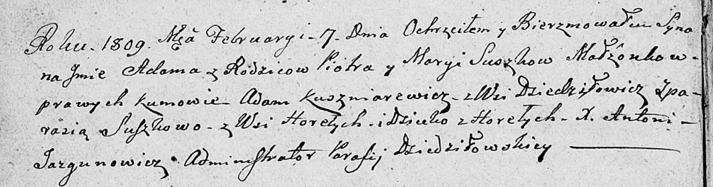
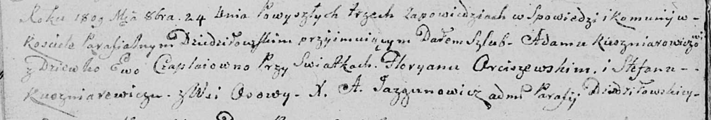

**Кушнеревич Адам (Kuszniarewicz Adam)**

27 января 1807 г -- крестный отец Ангели, дочери Адама и Марцели
Рапацевичей с деревни Дедиловичи (НИАБ 937-4-32, лист 14, №2/1807-р).

7 февраля 1809 г -- крестный отец Адама, сына Сушков Петра и Марыи с
деревни Горелое (НИАБ 136-13-894, лист 73об, №6/1809-р (ориг)).

24 октября 1809 г -- венчание с девкой Евой Чапляй (НИАБ 136-13-920,
лист 15об, №13/1809-б (ориг)).

**НИАБ 937-4-32:** Лист 14. **Метрическая запись №2/1807-р.**

Дедиловичский костел Наисвятейшего Сердца Иисуса. 27 января 1807 года.
Метрическая запись о крещении.

Rapacewiczowna Angela -- дочь родителей с деревни Дедиловичи.

Rapacewicz Cirilli -- отец.

Rapacewiczowa Marcella -- мать.

Kusznierewicz Adam -- крестный отец, с деревни Дедиловичи.

Komisionkowa Pruzyna -- крестная мать, с деревни Дедиловичи.

Skindzelewski Andreas -- ксёндз, викарий Дедиловичский.

**НИАБ 136-13-894:** Лист 73об. **Метрическая запись №6/1809-р (ориг).**

Дедиловичская Покровская церковь. 7 февраля 1809 года. Метрическая
запись о крещении.

Suszko Adam -- сын родителей с деревни Горелое.

Suszko Piotr -- отец.

Suszkowa Marya -- мать.

Kuszniarewicz Adam -- кум, с деревни Дедиловичи.

Suszkowa Parasia -- кума, с деревни Горелое.

Jazgunowicz Antoni -- ксёндз.

**НИАБ 136-13-920:** Лист 15об. **Метрическая запись №13/1809-б
(ориг).**

Дедиловичская Покровская церковь. 24 октября 1809 года. Метрическая
запись о венчании.

Kuszniarewicz Adam -- жених, с деревни \[Дедиловичи\].

Czaplajowna Ewa -- невеста, девка.

Arciszewski Fłoryan -- свидетель.

Kuszniarewicz Stefan -- свидетель, с деревни Осово.

Jazgunowicz Antoni -- ксёндз.
