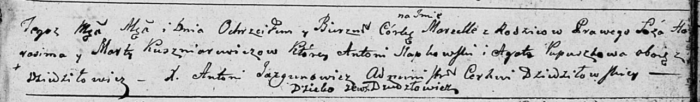
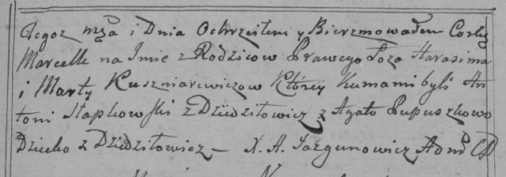
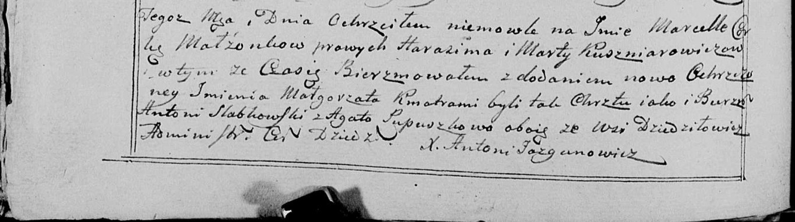

**Кушнеревич Марта (Kuszniarewiczowa Marta)**

23 октября 1799 г -- крещение дочери Марцеллы (НИАБ 136-13-894, лист 40,
№44/1799-р (ориг), РГИА 823-2-18, лист 273, №43/1799-р (коп), НИАБ
136-13-938, лист 244об, №41/1799-р (коп)).

**НИАБ 136-13-894:** Лист 40. **Метрическая запись №44/1799-р (ориг).**

Дедиловичская Покровская церковь. 23 октября 1799 года. Метрическая
запись о крещении.

Kuszniarewiczowna Marcella -- дочь родителей с деревни Дедиловичи.

Kuszniarewicz Harasim -- отец.

Kuszniarewiczowa Marta -- мать.

Słapkowski Antoni -- кум, с деревни Дедиловичи.

Pupuszkowa Agata -- кума, с деревни Дедиловичи.

Jazgunowicz Antoni -- ксёндз.

**РГИА 823-2-18:** Лист 273. **Метрическая запись №43/1799-р (коп).**

Дедиловичская Покровская церковь. 23 октября 1799 года. Метрическая
запись о крещении.

Kuszniarewiczowna Marcella -- дочь родителей с деревни Дедиловичи.

Kuszniarewicz Harasim -- отец.

Kuszniarewiczowa Marta -- мать.

Słapkowski Antoni -- кум, с деревни Дедиловичи.

Pupuszkowa Agata -- кума.

Jazgunowicz Antoni -- ксёндз.

**НИАБ 136-13-938:** Лист 244об. **Метрическая запись №41/1799-р
(коп).**

(См. тж. НИАБ 136-13-894, лист 40, №44/1799-р (ориг); РГИА 823-2-18,
лист 273, №43/1799-р (коп))

Дедиловичская Покровская церковь. 23 октября 1799 года. Метрическая
запись о крещении.

Kuszniarewiczowa Marcellа Małgorzata -- дочь родителей с деревни
\[Дедиловичи\].

Kuszniarewicz Harasim -- отец.

Kuszniarewiczowa Marta -- мать.

Słabkowski Antoni -- кум, с деревня Дедиловичи.

Pupuszkowa Agata - кума, с деревня Дедиловичи.

Jazgunowicz Antoni -- ксёндз.
