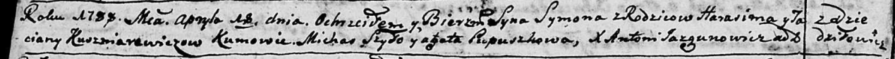
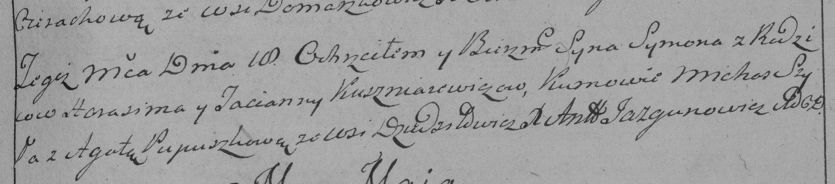

**Кушнеревич Сымон Гарасимов (Kusznirewicz Symon)**

18 апреля 1788 г -- крещение (НИАБ 136-13-894, лист 4об, №29/1788-р
(ориг)), (РГИА 823-2-18, лист 236, №13/1788-р (коп)).

**НИАБ 136-13-894:** Лист 4-об. **Метрическая запись №29/1788-р
(ориг).**

Дедиловичская Покровская церковь. 18 апреля 1788 года. Метрическая
запись о крещении.

Kuszniarewicz Symon -- сын родителей с деревни Дедиловичи.

Kuszniarewicz Harasim-- отец.

Kuszniarewiczowa Taciana -- мать.

Szyło Michaś - кум.

Pupuszkowa Agata - кума.

**РГИА 823-2-18:** Лист 236. **Метрическая запись №13/1788-р (коп).**

Дедиловичская Покровская церковь. 18 апреля 1788 года. Метрическая
запись о крещении.

Kuszniarewicz Symon -- сын родителей с деревни Дедиловичи.

Kuszniarewicz Harasim -- отец.

Kuszniarewiczowa Tacianna -- мать.

Szyło Michas -- кум.

Pupuszkowa Agata - кума.

Jazgunowicz Antoni -- ксёндз.
