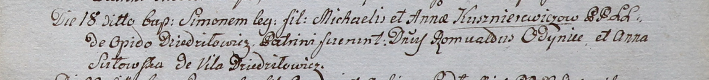

**Кушнеревич Сымон Михайлов (Kusznierewicz Simon)**

18 июля 1800 г -- крещение (НИАБ 937-4-32, лист 2, №22/1800-р (ориг)).

**НИАБ 937-4-32:** Лист 2. **Метрическая запись №22/1800-р.**

Дедиловичский костел Наисвятейшего Сердца Иисуса. 18 июля 1800 года.
Метрическая запись о крещении.

Kusznierewicz Simon -- сын крестьян с деревни Дедиловичи.

Kusznierewicz Michael -- отец.

Kusznierewiczowa Anna -- мать.

Odyniec Romuald -- крестный отец, шляхтич.

Sutowska Anna -- крестная мать, с деревни Дедиловичи.

Linhart Hyacinthus -- ксёндз.
