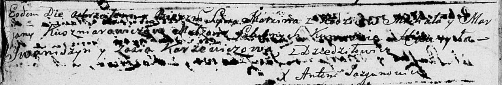

**Кушнеревич Марцин Михалов (Kuszniarowicz Marcin)**

26 октября 1790 г -- крещение (НИАБ 136-13-894, лист 11об, №76/1790-р
(ориг)).

**НИАБ 136-13-894:** Лист 11об. **Метрическая запись №76/1790-р
(ориг).**

Дедиловичская Покровская церковь. 26 октября 1790 года. Метрическая
запись о крещении.

Kuszniarowicz Marcin -- сын родителей с деревни Дедиловичи.

Kuszniarowicz Michał -- отец.

Kuszniarowiczowa Marjana -- мать.

Jwaniszyn Hawryla - кум.

Karżewiczowa Zosia - кума.

Jazgunowicz Antoni -- ксёндз.
