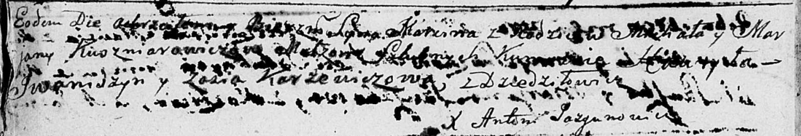

**Кушнеревич Михал (Kuszniarowicz Michał)**

26 октября 1790 г -- крещение сына Марцина (НИАБ 136-13-894, лист 11об,
№76/1790-р (ориг)).

**НИАБ 136-13-894:** Лист 11об. **Метрическая запись №76/1790-р
(ориг).**

{width="6.496527777777778in"
height="1.1103576115485565in"}

Дедиловичская Покровская церковь. 26 октября 1790 года. Метрическая
запись о крещении.

Kuszniarowicz Marcin -- сын родителей с деревни Дедиловичи.

Kuszniarowicz Michał -- отец.

Kuszniarowiczowa Marjana -- мать.

Jwaniszyn Hawryla - кум.

Karżewiczowa Zosia - кума.

Jazgunowicz Antoni -- ксёндз.
