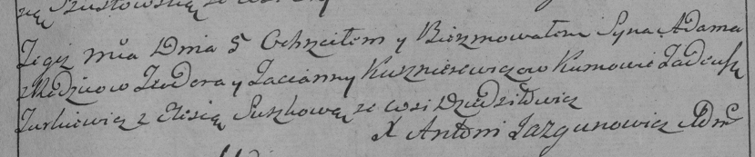

**Кушнеревич Адам (Kuszniarewicz Adam)**

5 октября 1788 г -- крещение (РГИА 823-2-18, лист 237, №31/1788-р
(коп)).

**РГИА 823-2-18:** Лист 237. **Метрическая запись №31/1788-р (коп).**

Дедиловичская Покровская церковь. 5 ноября 1788 года. Метрическая запись
о крещении.

Kusznierewicz Adam -- сын родителей с деревни Дедиловичи.

Kusznierewicz Teodor -- отец.

Kusznierewiczowa Tacianna -- мать.

Turkiewicz Tadeusz -- кум.

Suszkowa Elesia - кума.

Jazgunowicz Antoni -- ксёндз.
