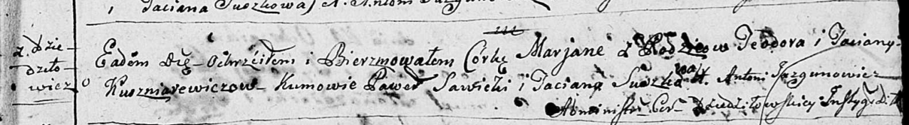

**Кушнеревич Марьяна Тодорова (Kuszniarewiczowna Marjana)**

17 февраля 1796 г -- крещение (НИАБ 136-13-894, лист 28, №21/1796-р
(ориг)).

Лист 28. **Метрическая запись №21/1796-р (ориг).**

{width="6.496527777777778in"
height="0.901159230096238in"}

Дедиловичская Покровская церковь. 17 февраля 1796 года. Метрическая
запись о крещении.

Kuszniarewiczowna Marjana -- дочь родителей с деревни Дедиловичи.

Kuszniarewicz Teodor -- отец.

Kuszniarewiczowa Taciana -- мать.

Sawicki Paweł - кум.

Suszkowa Taciana - кума.

Jazgunowicz Antoni -- ксёндз.
