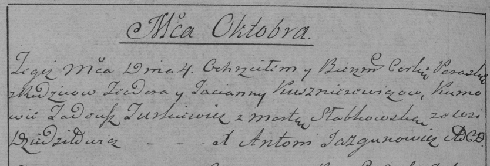

**Кушнеревич Параска Тодорова (Kuszniarewiczowna Paraska)**

4 октября 1786 г -- крещение (РГИА 823-2-18, лист 232об, №24/1786-р
(коп)).

**РГИА 823-2-18:** Лист 232об. **Метрическая запись №24/1786-р (коп).**

Дедиловичская Покровская церковь. 4 октября 1786 года. Метрическая
запись о крещении.

Kuszniarewiczowna Paraska -- дочь родителей с деревни Дедиловичи.

Kuszniarewicz Teodor -- отец.

Kuszniarewiczowa Tacianna -- мать.

Turkewicz Tadeusz -- кум.

Słabkowska Marta - кума.

Jazgunowicz Antoni -- ксёндз.
