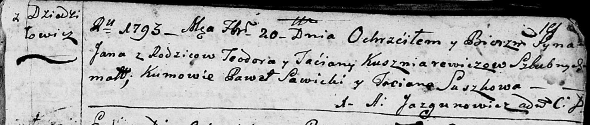
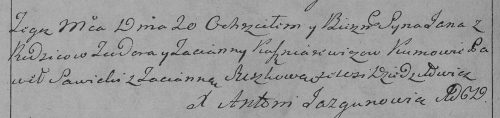
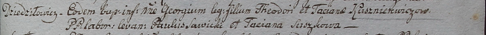

**Кушнеревич Тодор (Kuszniarewicz Teodor)**

4 октября 1786 г -- крещение дочери Параски (РГИА 823-2-18, лист 232об,
№24/1786-р (коп)).

5 октября 1788 г -- крещение сына Адама (РГИА 823-2-18, лист 237,
№31/1788-р (коп)).

7 сентября 1791 г -- крещение дочери Анны (НИАБ 136-13-894, лист 14,
№46/1791-р (ориг)).

20 февраля 1793 г -- крещение сына Яна (НИАБ 136-13-894, лист 19,
№20/1793-р (ориг)), (РГИА 823-2-18, лист 246, №8/1793-р (коп)).

17 февраля 1796 г -- крещение дочери Марьяны (НИАБ 136-13-894, лист 28,
№21/1796-р (ориг)).

14 января 1799 г -- крещение сына Георгия (НИАБ 1781-27-199, лист 125,
№5/1799-р).

23 октября 1799 г -- кум при крещении сына Самуэля у Сушков Петра и
Елеси с деревни Разлитье (НИАБ 136-13-894, лист 40, №43/1799-р (ориг)).

28 октября 1800 г -- свидетель венчания молодого Карпа Сушко с деревни
Разлитье с девкой Марьяной Бавтрук (НИАБ 136-13-949, лист 107об,
№5/1800-б (коп)).

10 февраля 1802 г -- крещение дочери Барбары (НИАБ 937-4-32, лист 6,
№4/1802-р).

19 мая 1807 г -- крестный отец Тодоры Елисаветы, дочери Сушков Нупрея и
Магдуси с деревни Разлитье (НИАБ 136-13-894, лист 62об, №26/1807-р
(ориг)).

**РГИА 823-2-18:** Лист 232об. **Метрическая запись №24/1786-р (коп).**

Дедиловичская Покровская церковь. 4 октября 1786 года. Метрическая
запись о крещении.

Kuszniarewiczowna Paraska -- дочь родителей с деревни Дедиловичи.

Kuszniarewicz Teodor -- отец.

Kuszniarewiczowa Tacianna -- мать.

Turkewicz Tadeusz -- кум.

Słabkowska Marta - кума.

Jazgunowicz Antoni -- ксёндз.

**РГИА 823-2-18:** Лист 237. **Метрическая запись №31/1788-р (коп).**

Дедиловичская Покровская церковь. 5 ноября 1788 года. Метрическая запись
о крещении.

Kusznierewicz Adam -- сын родителей с деревни Дедиловичи.

Kusznierewicz Teodor -- отец.

Kusznierewiczowa Tacianna -- мать.

Turkiewicz Tadeusz -- кум.

Suszkowa Elesia - кума.

Jazgunowicz Antoni -- ксёндз.

**НИАБ 136-13-894:** Лист 14. **Метрическая запись №46/1791-р (ориг).**

Дедиловичская Покровская церковь. 7 сентября 1791 года. Метрическая
запись о крещении.

Kuszniarewiczowna Anna -- дочь родителей с деревни Дедиловичи.

Kuszniarewicz Teodor -- отец.

Kuszniarewiczowa Taciana -- мать.

Jurkiewicz Thadeusz - кум.

Suszkowa Taciana - кума.

Jazgunowicz Antoni -- ксёндз.

**НИАБ 136-13-894:** Лист 19. **Метрическая запись №20/1793-р (ориг).**

Дедиловичская Покровская церковь. 20 февраля 1793 года. Метрическая
запись о крещении.

Kuszniarewicz Jan -- сын родителей с деревни Дедиловичи.

Kuszniarewicz Teodor -- отец.

Kuszniarewiczowa Taćiana -- мать.

Sawicki Pawel - кум.

Suszkowa Taciana - кума.

Jazgunowicz Antoni -- ксёндз.

**РГИА 823-2-18:** Лист 246об. **Метрическая запись №8/1793-р (коп).**

Дедиловичская Покровская церковь. 20 февраля 1793 года. Метрическая
запись о крещении.

Kuszniarewicz Jan -- сын родителей с деревни Дедиловичи.

Kuszniarewicz Teodor -- отец.

Kuszniarewiczowa Tacianna -- мать.

Sawicki Paweł -- кум.

Suszkowa Tacianna -- кума.

Jazgunowicz Antoni -- ксёндз.

**НИАБ 136-13-894:** Лист 28. **Метрическая запись №21/1796-р (ориг).**

Дедиловичская Покровская церковь. 17 февраля 1796 года. Метрическая
запись о крещении.

Kuszniarewiczowna Marjana -- дочь родителей с деревни Дедиловичи.

Kuszniarewicz Teodor -- отец.

Kuszniarewiczowa Taciana -- мать.

Sawicki Paweł - кум.

Suszkowa Taciana - кума.

Jazgunowicz Antoni -- ксёндз.

**НИАБ 1781-27-199:** Лист 125. **Метрическая запись №5/1799-р.**

Дедиловичский костел Наисвятейшего Сердца Иисуса. 14 января 1799 года.
Метрическая запись о крещении.

Kuszniarewicz Georgi -- сын крестьян с деревни Дедиловичи.

Kuszniarewicz Theodor -- отец.

Kuszniarewiczowa Taciana -- мать.

Sawicki Paul -- крестный отец.

Suszkowa Taciana - крестная мать.

Linhart Hyacinthus -- ксёндз.

**НИАБ 136-13-894:** Лист 40. **Метрическая запись №43/1799-р (ориг).**

Дедиловичская Покровская церковь. 23 октября 1799 года. Метрическая
запись о крещении.

Suzsko Samuel -- сын родителей с деревни Разлитье.

Suzsko Piotr -- отец.

Suzsko Elżbieta -- мать.

Kuszniarewicz Teodor -- кум, с деревни Дедиловичи.

Suszkowa Parasia -- кума, с деревня Горелое.

Jazgunowicz Antoni -- ксёндз.

**НИАБ 937-4-32:** Лист 6. **Метрическая запись №4/1802-р.**

Дедиловичский костел Наисвятейшего Сердца Иисуса. 10 февраля 1802 года.
Метрическая запись о крещении.

Kusznierewiczowna Barbara -- дочь крестьян с деревни Дедиловичи.

Kusznierewicz Theodor -- отец.

Kusznierewiczowa Tacyana -- мать.

Sawicki Paul -- крестный отец, с деревни Дедиловичи?.

Suszkowa Axinia -- крестная мать, с деревни Дедиловичи.

Linhart Hyacinthus -- ксёндз.

**НИАБ 136-13-894:** Лист 62об. **Метрическая запись №26/1807-р
(ориг).**

Дедиловичская Покровская церковь. 19 мая 1807 года. Метрическая запись о
крещении.

Suszkowa Todora Elżbieta -- дочь родителей с деревни Разлитье.

Suszko Nuprey -- отец.

Suszkowa Magdusia -- мать.

Kuszniarewicz Todor -- кум, с деревни Дедиловичи.

Suszkowa Marya -- кума, с деревни Разлитье.

Jazgunowicz Antoni -- ксёндз.
