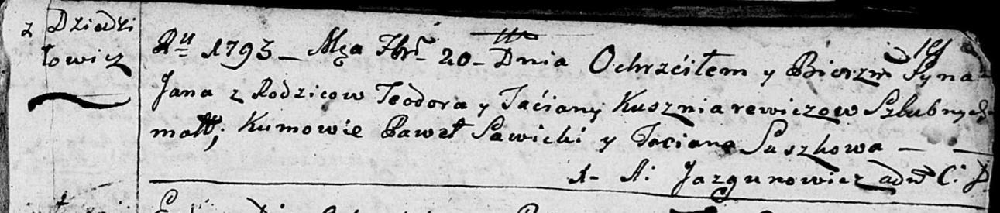
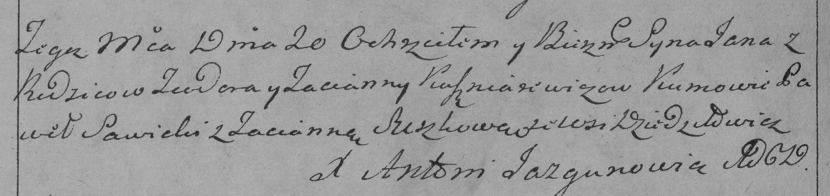

**Кушнеревич Ян Тодоров (Kuszniarewicz Jan)**

20 февраля 1793 г -- крещение (НИАБ 136-13-894, лист 19, №20/1793-р
(ориг)), (РГИА 823-2-18, лист 246, №8/1793-р (коп)).

**НИАБ 136-13-894:** Лист 19. **Метрическая запись №20/1793-р (ориг).**

Дедиловичская Покровская церковь. 20 февраля 1793 года. Метрическая
запись о крещении.

Kuszniarewicz Jan -- сын родителей с деревни Дедиловичи.

Kuszniarewicz Teodor -- отец.

Kuszniarewiczowa Taćiana -- мать.

Sawicki Pawel - кум.

Suszkowa Taciana - кума.

Jazgunowicz Antoni -- ксёндз.

**РГИА 823-2-18:** Лист 246об. **Метрическая запись №8/1793-р (коп).**

Дедиловичская Покровская церковь. 20 февраля 1793 года. Метрическая
запись о крещении.

Kuszniarewicz Jan -- сын родителей с деревни Дедиловичи.

Kuszniarewicz Teodor -- отец.

Kuszniarewiczowa Tacianna -- мать.

Sawicki Paweł -- кум.

Suszkowa Tacianna -- кума.

Jazgunowicz Antoni -- ксёндз.
