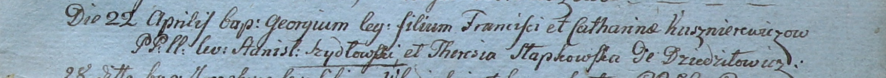

**Кушнеревич Георгий Францишков (Kuszniarewicz Georgi)**

22 апреля 1800 г -- крещение (НИАБ 937-4-32, лист 1, №11/1800-р).

**НИАБ 937-4-32:** Лист 1. **Метрическая запись №11/1800-р.**

Дедиловичский костел Наисвятейшего Сердца Иисуса. 22 апреля 1800 года.
Метрическая запись о крещении.

Kusznierewicz Georgi -- сын крестьян с деревни Дедиловичи.

Kusznierewicz Francisk -- отец.

Kusznierewiczowa Catharina -- мать.

Szydłowski Stanisław -- крестный отец.

Słapkowska Theresia -- крестная мать.

Linhart Hyacinthus -- ксёндз.
