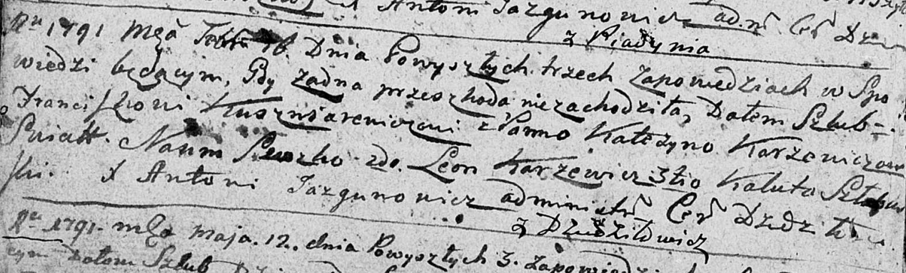
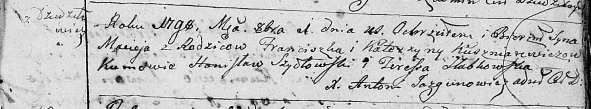
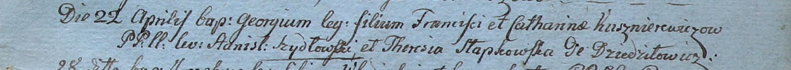

**Кушнеревич (Каржевич) Катерына (Kuszniarewiczowa Katerzyna z
Karżewiczow)**

16 февраля 1791 г -- венчание с Франтишкой Кушнеревичем с деревни
Дедиловичи (НИАБ 136-13-894, лист 69об, №11/1791-б (ориг)).

1 октября 1798 г -- крещение сына Мацея (НИАБ 136-13-894, лист 37,
№48/1798-р (ориг)), (РГИА 823-2-18, лист 266об, №49/1798-р (коп)).

22 апреля 1800 г -- крещение сына Георгия (НИАБ 937-4-32, лист 1,
№11/1800-р).

22 мая 1804 г -- крещение дочери Франциски (НИАБ 937-4-32, лист 10,
№12/1804-р).

Лист 69об. **Метрическая запись №11/1791-б (ориг).**

Дедиловичская Покровская церковь. 16 февраля 1791 года. Метрическая
запись о венчании.

Kuszniarewicz Franciszka -- жених, с деревни Дедиловичи.

Karżewiczowna Katerzyna -- невеста.

Suszko Naum -- свидетель.

Karżewicz Leon -- свидетель.

Szłabkowski? Kaluta -- свидетель.

Jazgunowicz Antoni -- ксёндз.

**НИАБ 136-13-894:** Лист 37. **Метрическая запись №48/1798-р (ориг).**

Дедиловичская Покровская церковь. 1 октября 1798 года. Метрическая
запись о крещении.

Kuszniarewicz Maciey -- сын родителей с деревни Дедиловичи.

Kuszniarewicz Franciszek -- отец.

Kuszniarewiczowa Katerzyna -- мать.

Szydłowski Stanislaw - кум.

Słabkowska Teresia - кума.

Jazgunowicz Antoni -- ксёндз.

**РГИА 823-2-18:** Лист 266об. **Метрическая запись №49/1798-р (коп).**

Дедиловичская Покровская церковь. 1 октября 1798 года. Метрическая
запись о крещении.

Kuszniarewicz Maciey -- сын родителей с деревни Дедиловичи.

Kuszniarewicz Franciszek -- отец.

Kuszniarewiczowa Katerzyna -- мать.

Szydłowski Stanisław -- кум.

Słabkowska Theresia -- кума.

Jazgunowicz Antoni -- ксёндз.

**НИАБ 937-4-32:** Лист 1. **Метрическая запись №11/1800-р.**

Дедиловичский костел Наисвятейшего Сердца Иисуса. 22 апреля 1800 года.
Метрическая запись о крещении.

Kusznierewicz Georgi -- сын крестьян с деревни Дедиловичи.

Kusznierewicz Francisk -- отец.

Kusznierewiczowa Catharina -- мать.

Szydłowski Stanisław -- крестный отец.

Słapkowska Theresia -- крестная мать.

Linhart Hyacinthus -- ксёндз.

**НИАБ 937-4-32:** Лист 10. **Метрическая запись №12/1804-р.**

Дедиловичский костел Наисвятейшего Сердца Иисуса. 22 мая 1804 года.
Метрическая запись о крещении.

Kusznierewiczowna Francisca -- дочь родителей с деревни Дедиловичи.

Kusznierewicz Franc -- отец.

Kusznierewiczowa Catharina -- мать.

Sawicki Dzienis -- крестный отец.

Słabkowska Teresia -- крестная мать.

Galinowski Joann -- ксёндз, комендант Дедиловичского костела.
