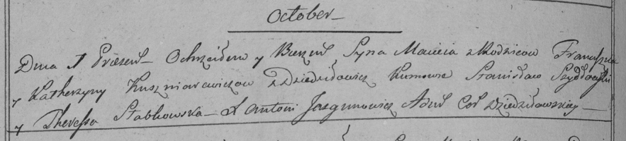

**Кушнеревич Мацей Францишков (Kuszniarewicz Maciey)**

1 октября 1798 г -- крещение (НИАБ 136-13-894, лист 37, №48/1798-р
(ориг)), (РГИА 823-2-18, лист 266об, №49/1798-р (коп)).

**НИАБ 136-13-894:** Лист 37. **Метрическая запись №48/1798-р (ориг).**

Дедиловичская Покровская церковь. 1 октября 1798 года. Метрическая
запись о крещении.

Kuszniarewicz Maciey -- сын родителей с деревни Дедиловичи.

Kuszniarewicz Franciszek -- отец.

Kuszniarewiczowa Katerzyna -- мать.

Szydłowski Stanislaw - кум.

Słabkowska Teresia - кума.

Jazgunowicz Antoni -- ксёндз.

**РГИА 823-2-18:** Лист 266об. **Метрическая запись №49/1798-р (коп).**

Дедиловичская Покровская церковь. 1 октября 1798 года. Метрическая
запись о крещении.

Kuszniarewicz Maciey -- сын родителей с деревни Дедиловичи.

Kuszniarewicz Franciszek -- отец.

Kuszniarewiczowa Katerzyna -- мать.

Szydłowski Stanisław -- кум.

Słabkowska Theresia -- кума.

Jazgunowicz Antoni -- ксёндз.
