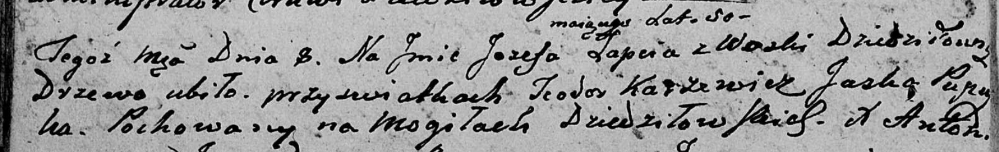

**Лапец Иосиф (Łapac Jozef)**

8 июня 1802 г -- отпевание, умер в возрасте 50 лет (родился около 1752
г), убит деревом (НИАБ 136-13-919, лист 12об, №5/1802-у (ориг)).

**НИАБ 136-13-919:** Лист 12об. **Метрическая запись №5/1802-у (ориг).**

Дедиловичская Покровская церковь. 8 июня 1802 года. Метрическая запись
об отпевании.

Łapać Jozef -- умерший, 50 лет, с деревни Дедиловичи, убило дерево при
свидетелях Karżewicz Teodor, Pupuszka Jaśka, похоронен на кладбище
деревни Дедиловичи.

Jazgunowicz Antoni -- ксёндз.
