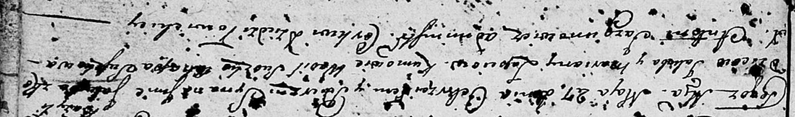

**Лапец Якуб Якубов (Łapiec Jakub? Bazyli)**

27 мая 1806 г -- крещение (НИАБ 136-13-894, лист 60, №26/1806-р (ориг)).

**НИАБ 136-13-894:** Лист 52об. **Метрическая запись №48/1803-р
(ориг).**

Дедиловичская Покровская церковь. 5 декабря 1803 года. Метрическая
запись о крещении.

Łapciowna Barbara Cecylia -- дочь родителей с деревни Дедиловичи.

Łapać Jakub -- отец.

Łapciowa Marjana -- мать.

Suszko Leon -- кум, с деревни Разлитье.

Suszkowa Ahafija -- кума, с деревни Разлитье.

Jazgunowicz Antoni -- ксёндз.

**НИАБ 136-13-894:** Лист 60. **Метрическая запись №26/1806-р (ориг).**

Дедиловичская Покровская церковь. 27 мая 1806 года. Метрическая запись о
крещении.

Łapać Jakub \[?\] Bazyl -- сын родителей с деревни \[Дедиловичи\].

Łapać Jakub -- отец.

Łapaciowa Mariana -- мать.

Suszko Wasil -- кум.

Suszkowa Ahapa -- кума.

Jazgunowicz Antoni -- ксёндз.
