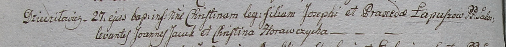

**Лапуш Иосиф (Łapusz Jozeph)**

27 марта 1799 г -- крещение дочери Христины (НИАБ 1781-27-199, лист 125,
№22/1799-б).

**НИАБ 1781-27-199:** Лист 125об. **Метрическая запись №22/1799-р.**

{width="6.496527777777778in"
height="0.6069444444444444in"}

Дедиловичский костел Наисвятейшего Сердца Иисуса. 27 марта 1799 года.
Метрическая запись о крещении.

Łapuszowna Christina -- дочь крестьян с деревни Дедиловичи.

Łapusz Joseph -- отец.

Łapuszowa Praxeda -- мать.

Jacuk Joann -- крестный отец.

Horawczycha Christina - крестная мать.

Linhart Hyacinthus -- ксёндз.
