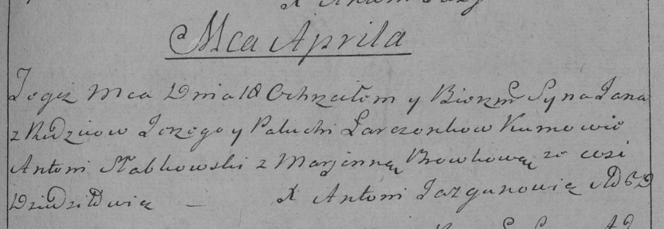

**Ларчёнок Палюха (Łarczonkowa Palucha)**

15 апреля 1792 г -- крещение сына Яна (НИАБ 136-13-894, лист 15об,
№20/1792-р (ориг)), (РГИА 823-2-18, лист 244, №8/1792-р (коп)).

**НИАБ 136-13-894:** Лист 15об. **Метрическая запись №20/1792-р
(ориг).**

{width="6.496527777777778in"
height="1.2665846456692913in"}

Дедиловичская Покровская церковь. 15 апреля 1792 года. Метрическая
запись о крещении.

Łarczonak Jan -- сын родителей с деревни Дедиловичи.

Łarczonak Jurka -- отец, селянин.

Łarczonkowa Palucha -- мать, селянка.

Słapkowski Antoni - кум.

Browkowa Marjana - кума.

Jazgunowicz Antoni -- ксёндз.

**РГИА 823-2-18:** Лист 244. **Метрическая запись №8/1792-р (коп).**

{width="6.496527777777778in"
height="2.245833333333333in"}

Дедиловичская Покровская церковь. 18 апреля 1792 года. Метрическая
запись о крещении.

Łarczonek Jan -- сын родителей с деревни Дедиловичи.

Łarczonek \[Jurka\] -- отец.

Łarczonkowa Palucha -- мать.

Słabkowski Antoni -- кум.

Browkowa Marjanna - кума.

Jazgunowicz Antoni -- ксёндз.
