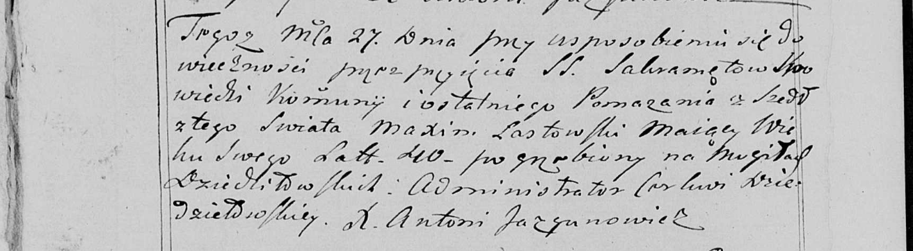

**Ластовский Максим (Łаstowski Maxim)**

27 августа 1799 г -- отпевание, умер в возрасте 40 лет (родился около
1759 г) (НИАБ 136-13-919, лист 9, №14/1799-у (ориг), НИАБ 136-13-938,
лист 251об, №14/1799-у (коп)).

**НИАБ 136-13-919:** Лист 9. **Метрическая запись №14/1799-у (ориг).**

Дедиловичская Покровская церковь. 27 августа 1799 года. Метрическая
запись об отпевании.

Łastowski Maxim -- умерший, 40 лет, с деревни Дедиловичи, похоронен на
кладбище деревни Дедиловичи.

Jazgunowicz Antoni -- ксёндз.

**НИАБ 136-13-938:** Лист 251об. **Метрическая запись №14/1799-у
(коп).**

(См. тж. НИАБ 136-13-919, Лист 9. Метрическая запись №14/1799-у (ориг))

Дедиловичская Покровская церковь. 27 августа 1799 года. Метрическая
запись об отпевании.

Łastowski Maxim -- умерший, 40 лет, с деревни \[Дедиловичи\], похоронен
на кладбище деревни Дедиловичи.

Jazgunowicz Antoni -- ксёндз.
