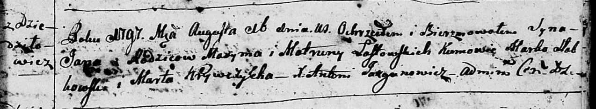
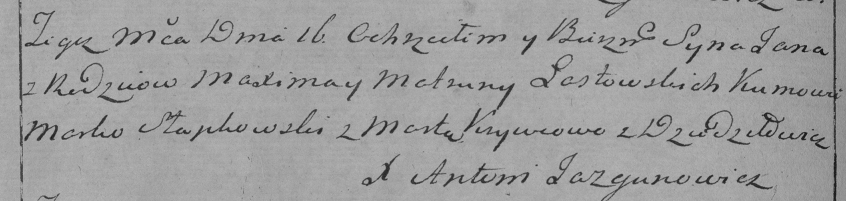

**Ластовская Марта (Łastowska Marta, Matruna)**

12 октября 1790 г -- крещение сына Грыгора (НИАБ 136-13-894, лист 11,
№68/1790-р (ориг)).

16 августа 1797 г -- крещение сына Яна (НИАБ 136-13-894, лист 34,
№51/1797-р (ориг)), (РГИА 823-2-18, лист 260об, №35/1797-р (коп)).

**НИАБ 136-13-894:** Лист 11. **Метрическая запись №68/1790-р (ориг).**

Дедиловичская Покровская церковь. 12 октября 1790 года. Метрическая
запись о крещении.

Łastowski Hrehory -- сын родителей с местечка Дедиловичи.

Łastowski Maxym -- отец.

Łastowska Marta -- мать.

Papko Atrachim - кум.

Juchnowcowa Marta - кума.

Jazgunowicz Antoni -- ксёндз.

**НИАБ 136-13-894:** Лист 34. **Метрическая запись №51/1797-р (ориг).**

Дедиловичская Покровская церковь. 16 августа 1797 года. Метрическая
запись о крещении.

Łastowski Jan -- сын родителей с деревни Дедиловичи.

Łastowski Maxym -- отец.

Łastowska Matruna -- мать.

Słabkowski Marka - кум.

Krywczycha Marta - кума.

Jazgunowicz Antoni -- ксёндз.

**РГИА 823-2-18:** Лист 260об. **Метрическая запись №35/1797-р (коп).**

Дедиловичская Покровская церковь. 16 августа 1797 года. Метрическая
запись о крещении.

Łastowski Jan -- сын родителей с деревни Дедиловичи.

Łastowski Maxim -- отец.

Łastowska Matruna -- мать.

Słapkowski Marko -- кум.

Krywcowa Marta -- кума.

Jazgunowicz Antoni -- ксёндз.
