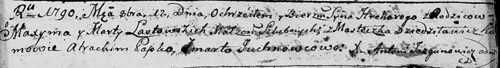

**Ластовский Грыгор Максымов (Łastowski Hregory)**

12 октября 1790 г -- крещение (НИАБ 136-13-894, лист 11, №68/1790-р
(ориг)).

**НИАБ 136-13-894:** Лист 11. **Метрическая запись №68/1790-р (ориг).**

Дедиловичская Покровская церковь. 12 октября 1790 года. Метрическая
запись о крещении.

Łastowski Hrehory -- сын родителей с местечка Дедиловичи.

Łastowski Maxym -- отец.

Łastowska Marta -- мать.

Papko Atrachim - кум.

Juchnowcowa Marta - кума.

Jazgunowicz Antoni -- ксёндз.
