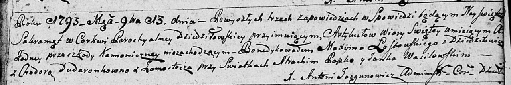

**Ластовский Максым (Łostowski Maxym)**

13 ноября 1793 г -- венчание с Ходорой Дударёнок с деревни Замосточье
(НИАБ 136-13-894, лист 72, №7/1793-б (ориг).

**НИАБ 136-13-894:** Лист 72. **Метрическая запись №7/1793-б (ориг).**

Дедиловичская Покровская церковь. 13 ноября 1793 года. Метрическая
запись о венчании.

Łostowski Maxym -- жених, с деревни Дедиловичи.

Dudaronkowna Chodora -- невеста, с деревни Замосточье.

Papko Atrachim -- свидетель.

Wasilewski Janka -- свидетель.

Jazgunowicz Antoni -- ксёндз.
