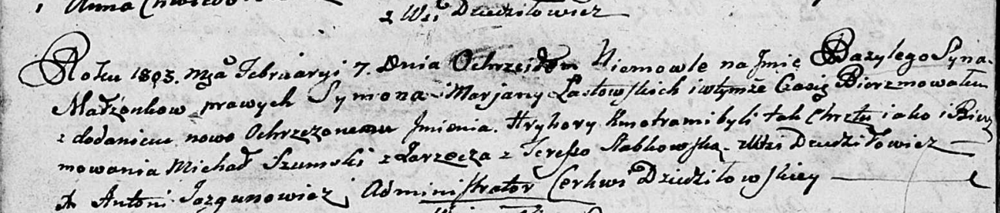

**Ластовский Сымон (Łastowski Symon)**

10 октября 1796 г -- венчание с девкой Марьяной Шило с деревни
Дедиловичи (НИАБ 136-13-920, лист 3, №10/1796-б (ориг)).

7 февраля 1803 г -- крещение сына Базыля Грыгора (НИАБ 136-13-894, лист
49об, №5/1802-р (ориг)).

**НИАБ 136-13-920:** Лист 3. **Метрическая запись №10/1796-б (ориг).**

Дедиловичская Покровская церковь. 10 октября 1796 года. Метрическая
запись о венчании.

Łastowski Symon -- жених, деревня Дедиловичи.

Szyłowna Marjanna -- невеста, девка, деревня Дедиловичи.

Browka Paweł -- свидетель, деревня Дедиловичи.

Bautruk Leon -- свидетель, деревня Нивки.

Jazgunowicz Antoni -- ксёндз.

**НИАБ 136-13-894:** Лист 49об. **Метрическая запись №5/1803-р (ориг).**

Дедиловичская Покровская церковь. 7 февраля 1803 года. Метрическая
запись о крещении.

Łastowski Bazyli Hryhory -- сын родителей с деревни Дедиловичи.

Łastowski Symon -- отец.

Łastowska Marjana -- мать.

Szumski Michał -- кум, с деревни Заречье.

Slabkowska Teresia -- кума, с деревни Дедиловичи.

Jazgunowicz Antoni -- ксёндз.
