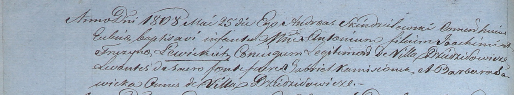

**Левицкий Яхим (Lewicki Joachim)**

25 мая 1808 г -- крещение сына Антона (НИАБ 937-4-32, лист 18об,
№15/1808-р).

**НИАБ 937-4-32:** Лист 18об. **Метрическая запись №15/1808-р.**

{width="6.496527777777778in"
height="1.2027777777777777in"}

Дедиловичский костел Наисвятейшего Сердца Иисуса. 25 мая 1808 года.
Метрическая запись о крещении.

Lewicki Antoni -- сын родителей с деревни Дедиловичи.

Lewiczki Joachim -- отец.

Lewiczka Fruzyna -- мать.

Kamisionek Gabriel -- крестный отец, с деревни Дедиловичи.

Sawicka Barbara -- крестная мать, с деревни Дедиловичи.

Scindzelewski Andreas -- ксёндз, комендант Дедиловичский.
